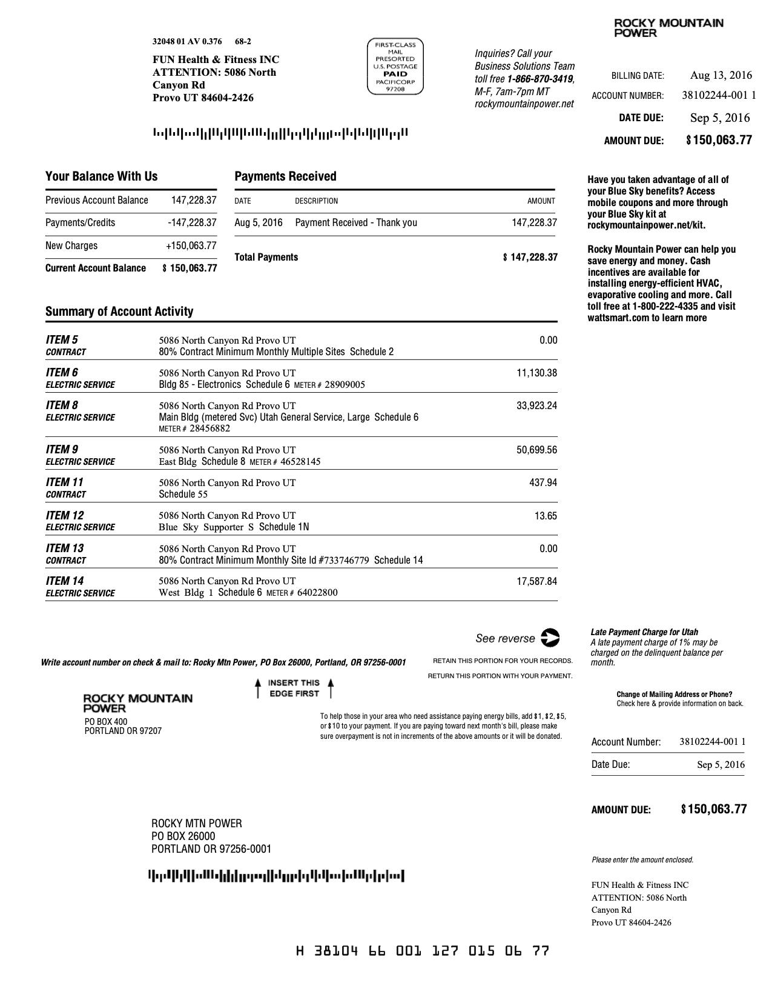

```{r, include = FALSE}
knitr::opts_chunk$set(
  collapse = TRUE,
  comment = "#>"
)
```

```{r setup}
# devtools::install_github("BYUIDSS/Rbills")
library(Rbills)
```

## Using the electrical bill function

Rocky Mountain Power commercial electrical bills include a list of buildings on the first page. Notice the list in the image shown below.  This is the first page of the *example_powerbill.pdf* included with the package. See that the named buildings are just below the address and that they have a meter number associated on the same line.  



By providing the text name of the building we can then process the data from the multi-page pdf and find the energy usage from that monthly building.  Let's pull the data for the following buildings.

- East Bldg
- Main Bldg
- Bldg 85
- West Bldg 1
- West Bldg 2


```{r}
path <- system.file("data-raw", package = "Rbills", mustWork = TRUE)

# Choose 'example_powerbill' file.
x <- list.files(path, "powerbill")

# Type Bldg 85, Main Bldg, East Bldg, West Bldg 1, West Bldg 2 when prompt function occurs.
power_table <- read_pdf_rmp(path, x, building_names = c("Bldg 85", "Main Bldg", "East Bldg", "West Bldg 1", "West Bldg 2"))
```

Then you can see the table of data

```{r}
knitr::kable(power_table)
```


